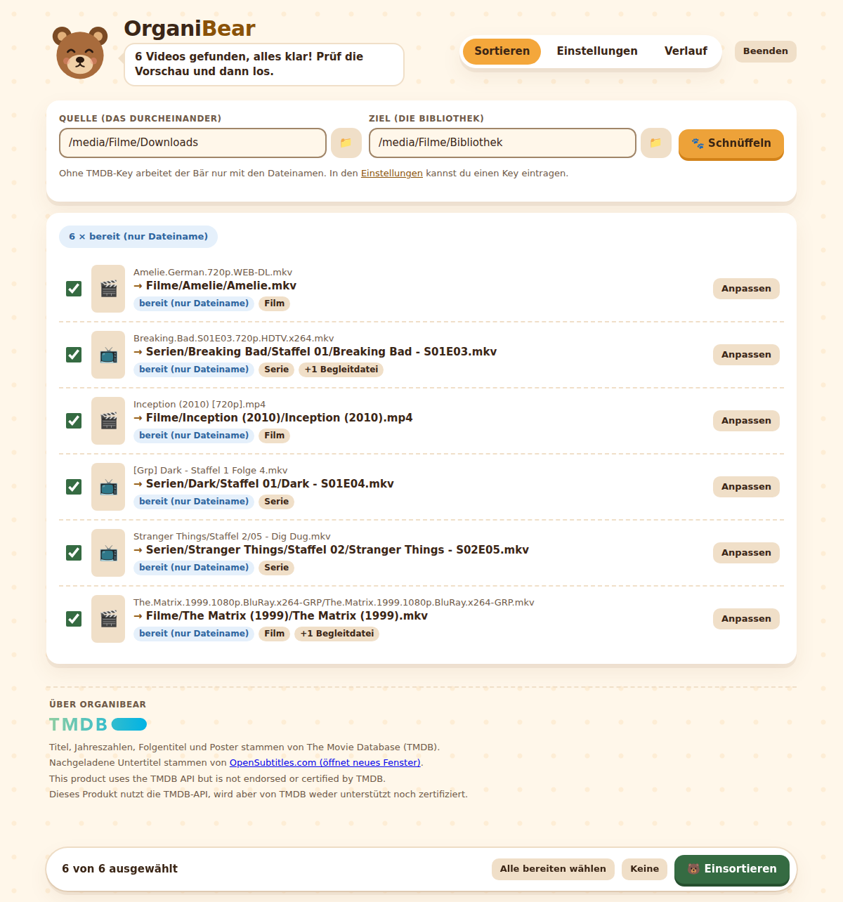

# ʕ•ᴥ•ʔ OrganiBear

Der Bär, der deine Filme und Serien aufräumt.

OrganiBear nimmt einen Ordner voller wild benannter Videodateien
(`The.Matrix.1999.1080p.BluRay.x264-GRP.mkv`, `breaking bad - 1x03.avi` …),
erkennt Titel, Jahr, Staffel und Folge, holt die richtigen Daten von
[TMDB](https://www.themoviedb.org) und sortiert alles nach deiner eigenen Vorlage
in eine ordentliche Bibliothek.



## Was er kann

- **Ein einziges Programm.** Starten, der Browser öffnet sich, fertig. Keine Installation, keine Abhängigkeiten.
- **Versteht viele Namensmuster:** `S01E02`, `1x02`, `Staffel 1 Folge 2`, Doppelfolgen (`S02E01E02`), Release-Gruppen, Qualitätsangaben, Jahreszahlen im Titel (`Blade Runner 2049 (2017)`), Ordnernamen wie `Serie/Staffel 2/05.mkv`.
- **Metadaten von TMDB:** richtiger Titel in deiner Sprache, Jahr und Folgentitel. Bei Unsicherheit wählst du aus den Treffern, suchst selbst oder trägst die Daten von Hand ein. Ohne API-Key arbeitet er nur mit den Dateinamen.
- **Eigene Namensvorlagen** für Filme und Serien, mit Live-Vorschau.
- **Dateiregeln:** Du legst fest, welche Dateiendungen Videos und welche Begleitdateien sind (Untertitel, NFO, Bilder …) und ob sie verschoben, kopiert oder ignoriert werden. Begleitdateien bekommen den neuen Namen ihres Videos (`Film (2010).de.srt`).
- **Erst Vorschau, dann Aktion.** Nichts wird bewegt, bevor du bestätigst. Vorhandene Dateien werden nie überschrieben.
- **Rückgängig:** Jeder Lauf landet im Verlauf und lässt sich mit einem Klick zurückdrehen.
- **Fehlende Untertitel** in deinen Sprachen lädt er auf Wunsch von OpenSubtitles.com nach.
- **Für Plex, Jellyfin und Kodi:** auf Wunsch NFO-Dateien, Poster und Hintergrundbilder dazu, danach liest der Mediaserver seine Bibliothek neu ein.

## Loslegen

1. Programm für dein System unter [Releases](https://github.com/DGne-Nurag/OrganiBear/releases) laden
   (oder selbst bauen, siehe unten). Unter macOS und Linux vorher `chmod +x` ausführen; macOS
   fragt beim ersten Start nach, weil das Programm nicht signiert ist (Rechtsklick › Öffnen).
2. Starten. Das Webinterface öffnet sich im Browser. Der Link steht auch im Programmfenster.
3. Unter **Einstellungen** den TMDB-Key eintragen (kostenlos unter
   [themoviedb.org/settings/api](https://www.themoviedb.org/settings/api)), Vorlagen und Dateiregeln anpassen.
4. Unter **Sortieren** Quelle und Ziel wählen, **Schnüffeln** drücken, Vorschau prüfen, **Einsortieren**.

### Optionen

```
organibear [-addr 127.0.0.1:8765] [-config pfad/organibear.json] [-no-browser] [-idle 5m]
```

**Beenden:** über den Knopf „Beenden“ oben rechts im Webinterface, mit Strg+C im Programmfenster
oder einfach Tab schließen: Ist 5 Minuten lang kein Tab mehr offen, legt sich der Bär von selbst schlafen
(`-idle 0` schaltet das ab). In allen drei Fällen wird ein laufendes Einsortieren vorher noch fertig;
ein zweites Strg+C bricht sofort ab.

Die Konfiguration liegt standardmäßig als `organibear.json` neben dem Programm,
der Verlauf im Ordner `organibear-verlauf` daneben.

## Mediaserver

Unter **Einstellungen › Mediaserver** lässt sich einschalten, was beim Einsortieren zusätzlich passiert
(nur für Einträge mit TMDB-Treffer):

- **NFO-Dateien** im Kodi-Format mit Titel, Inhalt, Genres sowie TMDB-, IMDb- und TheTVDB-ID. Kodi, Jellyfin und Emby
  lesen sie direkt, Plex mit einem NFO-Agent.
- **Bilder von TMDB:** `poster.jpg` und `fanart.jpg` im Film- bzw. Serienordner, Staffelposter (`season01-poster.jpg`)
  und Vorschaubilder für Folgen (`<Folge>-thumb.jpg`). Liegen mehrere Filme in einem Ordner, heißen die Bilder
  `<Film>-poster.jpg` und `<Film>-fanart.jpg`.
- **Bibliothek neu einlesen:** Nach dem Einsortieren stößt OrganiBear Plex (Adresse und Plex-Token), Jellyfin
  (Adresse und API-Schlüssel) und Kodi (Adresse der Web-Steuerung, ggf. Benutzer und Passwort) an. Mit „Testen“
  prüfst du die Zugangsdaten sofort.

Vorhandene Dateien werden nie überschrieben, „Rückgängig“ entfernt die angelegten Dateien wieder.
Die Zugangsdaten liegen nur in der lokalen Konfigurationsdatei.

## Untertitel

Unter **Einstellungen › Untertitel von OpenSubtitles** lassen sich fehlende Untertitel nachladen. Nach dem
Einsortieren prüft OrganiBear für jede eingestellte Sprache (Standard: `de, en`), ob schon ein Untertitel neben dem
Video liegt (auch `ger`, `deu`, `eng` usw. im Namen). Fehlt einer, sucht er per Datei-Fingerabdruck (OpenSubtitles-Hash)
und TMDB-ID und speichert den besten Treffer als `<Video>.de.srt`. Treffer mit passendem Fingerabdruck und
menschliche Übersetzungen gehen vor.

- Du brauchst einen eigenen **API-Key** von [opensubtitles.com](https://www.opensubtitles.com/consumers)
  („API consumers“). Ohne Konto sind nur wenige Downloads pro Tag erlaubt (laut OpenSubtitles 5),
  mit kostenlosem Konto mehr (20). Ist das Tageslimit erreicht, sagt der Bär Bescheid.
- Übertragen werden Fingerabdruck, Dateigröße, Sprachen und TMDB-ID, aber keine Dateinamen oder Pfade.
- Vorhandene Untertitel werden nie überschrieben, „Rückgängig“ entfernt die geladenen wieder.
- Laut den Nutzungsbedingungen von OpenSubtitles ist eine **kommerzielle Nutzung nicht erlaubt**.

## Sicherheit und Barrierefreiheit

- Das Webinterface lauscht nur auf dem eigenen Rechner (127.0.0.1) und lässt sich nicht ins Netzwerk öffnen.
- Zugang gibt es nur über den Startlink mit einem zufälligen Schlüssel, der bei jedem Start neu erzeugt wird. Andere Programme, andere Benutzer und fremde Webseiten im Browser kommen nicht an die Oberfläche.
- Dateien werden nie überschrieben, auch nicht bei gleichzeitigen Schreibzugriffen, sofern das Dateisystem Hardlinks kann (NTFS, APFS, ext4 …). Symlinks werden weder als Quelle verfolgt noch als Ausweg aus dem Zielordner zugelassen.
- Konfiguration (mit API-Key) und Verlauf sind unter macOS und Linux nur für den eigenen Benutzer lesbar. Der Verlauf wird vor jedem Rückgängigmachen geprüft.
- Die Oberfläche ist mit Tastatur und Screenreader bedienbar, erfüllt die Kontrastvorgaben nach WCAG 2.2 AA in hellem und dunklem Modus und respektiert „Bewegung reduzieren“.

## Vorlagen

`/` trennt Ordner, die Dateiendung wird automatisch angehängt. Zahlen lassen sich
mit `:breite` auffüllen (`{season:02}` → `01`). Leere Platzhalter verschwinden
samt Klammern und Strichen.

| Platzhalter | Bedeutung |
|---|---|
| `{title}` | Titel (in der eingestellten Sprache) |
| `{original_title}` | Originaltitel |
| `{year}` | Erscheinungsjahr |
| `{season}`, `{episode}` | Staffel, Folge (Doppelfolgen werden zu `01-E02`) |
| `{episode_title}` | Folgentitel |
| `{resolution}` | Auflösung aus dem Dateinamen, z. B. `1080p` |
| `{tmdb_id}` | TMDB-ID |
| `{first_letter}` | Anfangsbuchstabe ohne Artikel, z. B. `M` für „The Matrix“ |

Standard:

```
Filme/{title} ({year})/{title} ({year})
Serien/{title} ({year})/Staffel {season:02}/{title} - S{season:02}E{episode:02} - {episode_title}
```

## Selbst bauen

Benötigt [Go](https://go.dev) 1.24 oder neuer.

```sh
go build -o organibear .
# für Windows:
GOOS=windows GOARCH=amd64 go build -o organibear.exe .
```

Tests: `go test ./...`

CI prüft bei jedem Push und zusätzlich jeden Montag:

- `go test` inklusive Sicherheitstests (`security_test.go`)
- `govulncheck`: bekannte Sicherheitslücken in Go und im Code
- `staticcheck` und `gosec`: statische Analyse (bewusste Ausnahmen sind mit `#nosec` und Begründung markiert)
- Barrierefreiheit nach WCAG 2.2 AA mit Playwright und axe, hell und dunkel, inklusive Tastaturbedienung und 320 px Breite:
  `cd e2e && npm ci && npx playwright install chromium && npm test`

Den Screenshot oben erzeugt `cd e2e && npm run screenshot` neu.

## TMDB

<a href="https://www.themoviedb.org"></a>

This product uses the TMDB API but is not endorsed or certified by TMDB.
Dieses Produkt nutzt die TMDB-API, wird aber von TMDB weder unterstützt noch zertifiziert.

Der Hinweis und das Logo stehen auch im Programm unten im Bereich „Über OrganiBear“.
Die kostenlose TMDB-API ist nur für nicht-kommerzielle Nutzung gedacht; jeder Nutzer trägt seinen eigenen API-Key ein.

## Release veröffentlichen

Ein Tag startet den Release-Workflow. Er testet, baut Windows, macOS (Intel und Apple Silicon)
und Linux (amd64 und arm64) und legt ein GitHub-Release mit den Programmen und `SHA256SUMS` an.
Die Version steht danach im Startbanner. Tags mit Bindestrich (`v0.2.0-rc1`) werden als Vorabversion markiert.

```sh
git tag v0.1.0
git push origin v0.1.0
```
